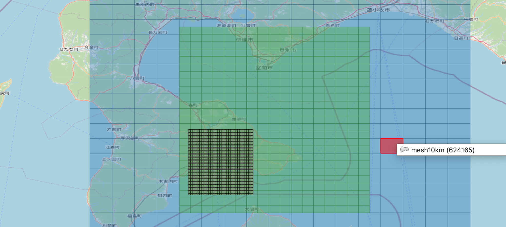

# 🕸️ rust-jp-mesh

標準地域メッシュを扱うRustライブラリです。[Re:Earth Flow](https://github.com/reearth/reearth-flow) 用に実装したプログラムに基づいています。

現在、以下の地域メッシュに対応しています。

- 第1次地域区画: `JPMeshType::Mesh80km`
- 第2次地域区画: `JPMeshType::Mesh10km`
- 基準地域メッシュ: `JPMeshType::Mesh1km`
- 2分の1地域メッシュ: `JPMeshType::Mesh500m`
- 4分の1地域メッシュ: `JPMeshType::Mesh250m`
- 8分の1地域メッシュ: `JPMeshType::Mesh125m`
- 5倍地域メッシュ: `JPMeshType::Mesh5km`
- 2倍地域メッシュ: `JPMeshType::Mesh2km`

メッシュ作成処理は[総務省統計局「第1章 地域メッシュ統計の特質・沿革」](https://www.stat.go.jp/data/mesh/pdf/gaiyo1.pdf)を参考としています。

## 🕸️ 機能

地理座標系は世界測地系 (WGS84) です。

- 座標 ➡️ 地域メッシュ: `JPMesh::new()`
- 矩形領域 ➡️ 地域メッシュ (複数) `JPMesh::from_on_bounds()`
- 地域メッシュ ➡️ メッシュの矩形領域 `JPMesh::to_bounds()`
- 地域メッシュ ↔️ メッシュコード `JPMesh::to_number()`/`JPMesh::from_number()`

```rust
let coords = Coordinates::new(139.767125, 35.681236);   // 座標を表現
let mesh = JPMesh::new(coords, JPMeshType::Mesh1km);    // 基準地域メッシュを作成

assert_eq!(mesh.to_number(), 53394611);                 // メッシュコードへの変換
assert!(mesh.to_bounds().includes(coords));             // もとの座標が矩形領域内に存在するか確認
```

## 🕸️ 拡張

新しい地域メッシュへの対応を追加する場合、以下の作業が必要です:

- `CodeNum`型を拡張する形でメッシュコードの作成処理を[`calcs`](./src/calcs/)ディレクトリに実装 ([`calcs/to_125m.rs`](./src/calcs/to_125m.rs) 等を参考としてください)
- [`mesh_type.rs`](./src/mesh_type.rs) にメッシュの種類を追加
- [`mesh.rs`](./src/mesh.rs) に新規作成した地域メッシュを適用
- [`examples/mesh_to_geojson.rs`](./examples/mesh_to_geojson.rs) に地域メッシュを適用

## 🕸️ 検証・サンプルコード

以下のexampleを作成しています。

- [`examples/mesh_to_geojson.rs`](./examples/mesh_to_geojson.rs)
: サンプルとなる地域メッシュをgeojsonとして出力 (作成結果は[`out`ディレクトリ](./out/)にて)

出力内容の目視検証には[Japanese Grid Mesh (QGIS拡張)](https://plugins.qgis.org/plugins/japanese_grids/) によるメッシュの作成結果を参考としています。

## 🕸️ プレビュー



## 🕸️ ライセンス

MIT
